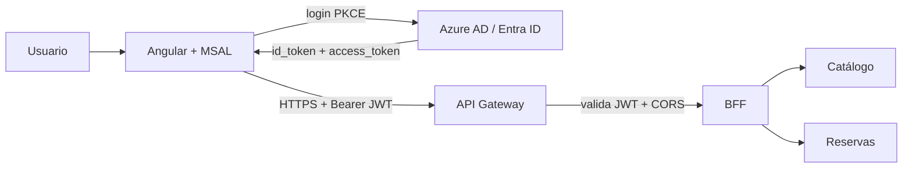

# Arquitectura AndesStay (v1)

Alcance de la evaluación: login con Azure AD, JWT por API Gateway, BFF que valida el token, y dos microservicios detrás del BFF. El navegador **solo** habla con el Gateway.

## Flujo JWT (resumen)

1. El usuario abre Angular (`localhost:4200`).
2. MSAL redirige a Azure AD (PKCE, sin client secret).
3. Azure AD autentica y devuelve tokens (access token v2, audience = App ID URI).
4. El interceptor de Angular envía `Authorization: Bearer <access_token>` al Gateway.
5. El Gateway valida el JWT. Si falta o es inválido → **401**.
6. El BFF vuelve a validar issuer, audience, firma, expiración y **roles**.
7. Sin rol adecuado → **403**. Con rol → responde (ej. `/api/me`) y/o llama a catálogo o reservas.
8. Catálogo y reservas no se exponen al browser.

## Repositorios

| Componente | Repo | Dueño |
| --- | --- | --- |
| Frontend | [andesstay-frontend](https://github.com/cristianmonsalve14/andesstay-frontend) | Cristian |
| BFF | [andesstay-ms-bff](https://github.com/HeOlivares/andesstay-ms-bff) | Héctor |
| Catálogo | [andesstay-ms-catalog](https://github.com/HeOlivares/andesstay-ms-catalog) | Héctor |
| Reservas | [andesstay-ms-reservations](https://github.com/RolandoLillo/andesstay-ms-reservations) | Rolando |
| Infra / Gateway | [andesstay-infra](https://github.com/RolandoLillo/andesstay-infra) | Rolando |
| Docs | este repo | Cristian |

Kanban único: [AndesStay — Kanban](https://github.com/users/cristianmonsalve14/projects/3).

## URLs (local, placeholders)

| Servicio | URL |
| --- | --- |
| Frontend | `http://localhost:4200` |
| Gateway (placeholder hasta que Rolando publique la URL) | `http://localhost:8080` |
| Frontend `apiUrl` | `http://localhost:8080/api` |
| BFF (detrás del Gateway) | lo define Héctor |
| Catálogo | lo define Héctor |
| Reservas health (referencia) | `http://localhost:8082/reservations/health` |

Cuando exista Gateway en EC2, se actualiza `apiUrl` en el frontend y esta tabla.

## Qué **no** entra en v1

- Kafka / RabbitMQ / bus de eventos
- Cinco microservicios extra
- Client secret en la App Registration
