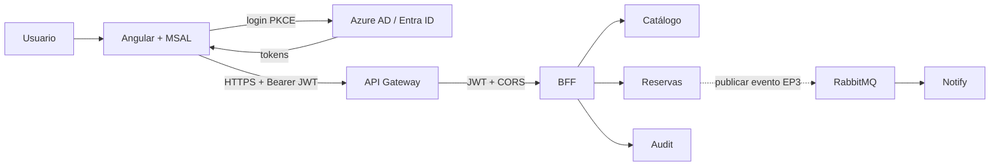

# Arquitectura AndesStay (v2)

Alcance operativo: login Azure AD, JWT (Gateway + BFF), microservicios de dominio detrás del BFF, panel de auditoría, y mensajería RabbitMQ (notify; admin/publisher EP3 en curso).

El navegador **solo** habla con Azure AD (login) y con el **API Gateway / BFF** (`/api`). Nunca llama directo a catálogo, reservas, audit ni notify.

```mermaid
flowchart LR
  U[Usuario]
  FE[Angular + MSAL]
  AAD[Azure AD / Entra ID]
  GW[API Gateway]
  BFF[BFF]
  CAT[Catálogo]
  RES[Reservas]
  AUD[Audit]
  RMQ[RabbitMQ]
  NTF[Notify]

  U --> FE
  FE -->|login PKCE| AAD
  AAD -->|tokens| FE
  FE -->|HTTPS + Bearer JWT| GW
  GW -->|JWT + CORS| BFF
  BFF --> CAT
  BFF --> RES
  BFF --> AUD
  RES -.->|publicar evento EP3| RMQ
  RMQ --> NTF
```

## Flujo JWT (resumen)

1. Usuario abre Angular (`http://localhost:4200`).
2. MSAL → Azure AD (Authorization Code + PKCE, **sin** client secret).
3. Access token v2 con `roles` y scope `access_as_user`.
4. Interceptor / llamadas con `Authorization: Bearer` a `apiUrl` (Gateway o BFF local).
5. Gateway: CORS + JWT → sin token **401**.
6. BFF: issuer, audience, firma, exp + **roles** → sin permiso **403**.
7. BFF proxea a catálogo, reservas y audit según ruta.
8. Dominio **no** se expone al browser.

## Flujo mensajería (EP3)

1. Caso de uso asíncrono (ej. reserva confirmada) → productor publica a exchange `cmd.direct` / `cmd.topic`.
2. Colas: `q.cmd.email`, `q.cmd.housekeeping`, `q.cmd.voucher` (+ `*.dlq`).
3. `andesstay-ms-notify` consume con `@RabbitListener`, ACK manual; fallo → NACK sin requeue → DLQ.
4. MS administrador (en construcción): API REST para crear/eliminar colas, exchanges y bindings.

Detalle de nombres: [notify README](https://github.com/HeOlivares/andesstay-ms-notify).

## Repositorios

| Componente | Repo | Dueño |
| --- | --- | --- |
| Frontend | [andesstay-frontend](https://github.com/cristianmonsalve14/andesstay-frontend) | Cristian |
| Docs | [andesstay-docs](https://github.com/cristianmonsalve14/andesstay-docs) | Cristian |
| BFF | [andesstay-ms-bff](https://github.com/HeOlivares/andesstay-ms-bff) | Héctor |
| Catálogo | [andesstay-ms-catalog](https://github.com/HeOlivares/andesstay-ms-catalog) | Héctor |
| Notify | [andesstay-ms-notify](https://github.com/HeOlivares/andesstay-ms-notify) | Héctor |
| Rabbit admin | pendiente (EP3) | Héctor |
| Reservas | [andesstay-ms-reservations](https://github.com/RolandoLillo/andesstay-ms-reservations) | Rolando |
| Audit | Rolando (`andesstay-ms-audit`) | Rolando |
| Infra / Gateway | [andesstay-infra](https://github.com/RolandoLillo/andesstay-infra) | Rolando |

Kanban: [AndesStay — Kanban](https://github.com/users/cristianmonsalve14/projects/3).

## URLs locales (lab)

| Servicio | URL típica |
| --- | --- |
| Frontend | `http://localhost:4200` |
| BFF (lab Windows; 8080 a veces ocupado) | `http://localhost:8083` |
| Frontend `apiUrl` | `http://localhost:8083/api` (local) o Gateway en nube |
| Catálogo | detrás del BFF (`/api/catalog/...`) |
| Reservas | detrás del BFF (`/api/reservations/...`) |
| Audit | detrás del BFF (`/api/audit/...`) |
| Notify health | `GET /api/notify/health` (puerto según compose) |
| RabbitMQ AMQP / UI | `5672` / `15672` (cuando Rolando lo agregue al compose) |

En EC2/compose del equipo el BFF suele publicarse en **8080**. No commitear URLs de lab personales en `main` del frontend.

## Roles → acceso (Caso 5 / producto)

| Rol | Catálogo | Reservas | Auditoría |
| --- | --- | --- | --- |
| Admin | ver + crear/editar | ver + crear + estado | sí |
| Operador | ver | ver + crear + estado | no |
| Cliente | 403 en BFF (no opera catálogo) | ver propias + crear | no |
| Auditor | no opera | no opera | sí |

## Matriz y evidencias

- [MATRIZ-FUNCIONALIDADES.md](MATRIZ-FUNCIONALIDADES.md)
- [evidencias/](evidencias/README.md)
- Identidad: [IDENTIDAD.md](IDENTIDAD.md)

## Fuera de este documento

- Client secret en App Registration (no aplica; PKCE).
- MS report / KPIs avanzados (parking lot semestre).
